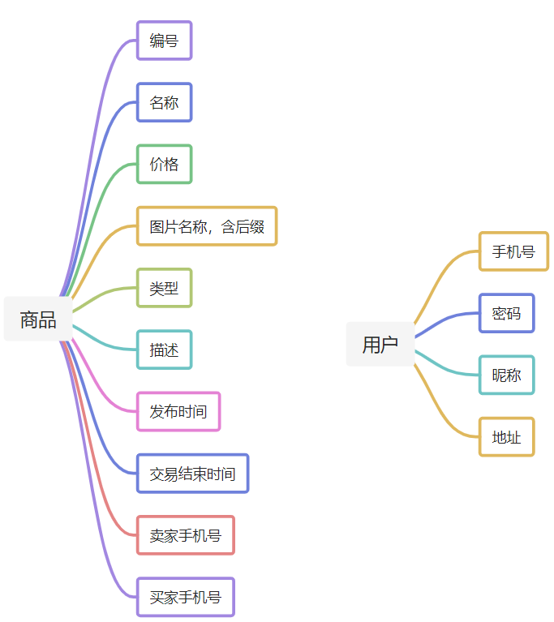
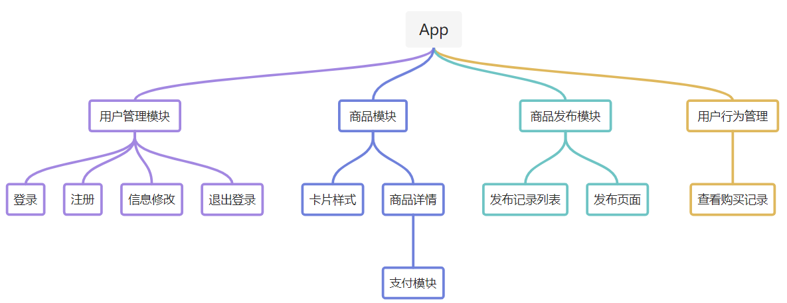
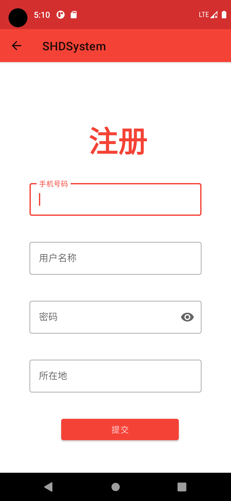
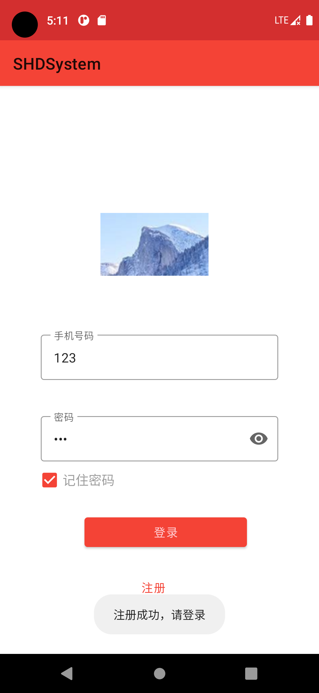
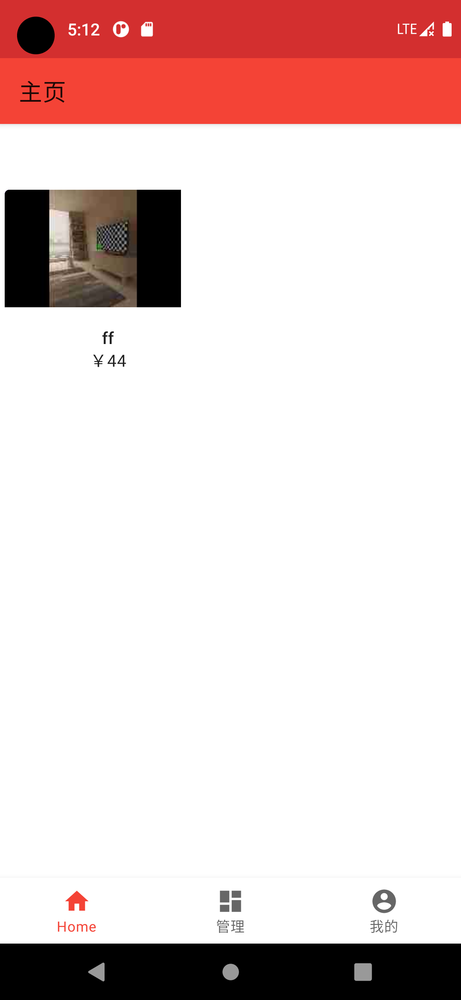
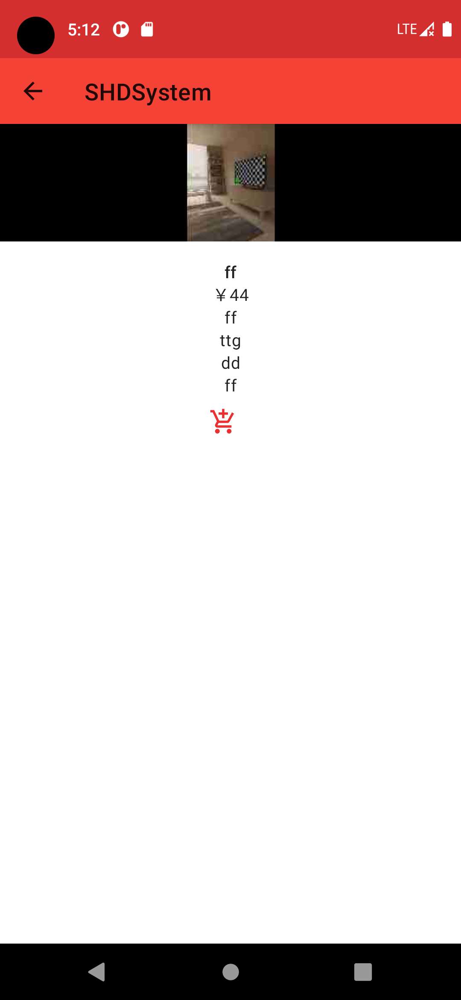
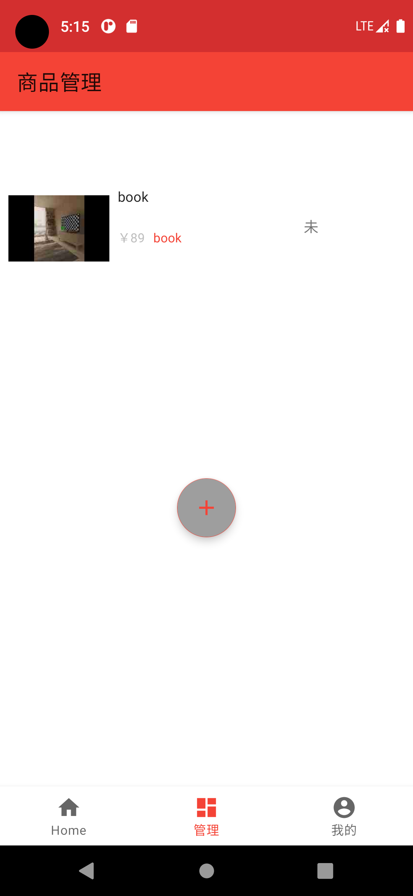
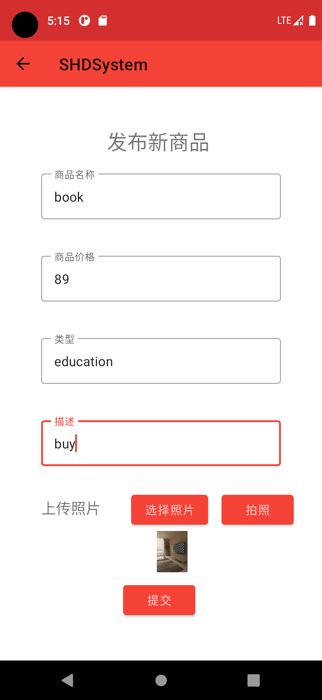
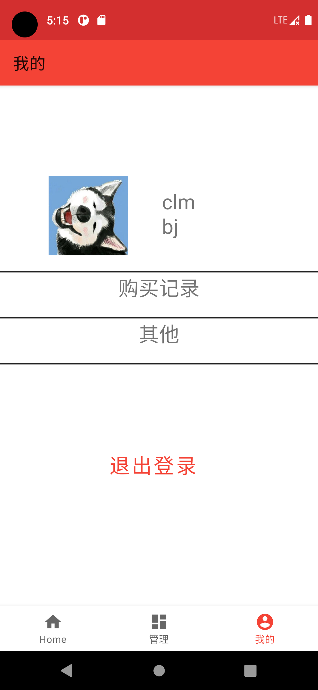
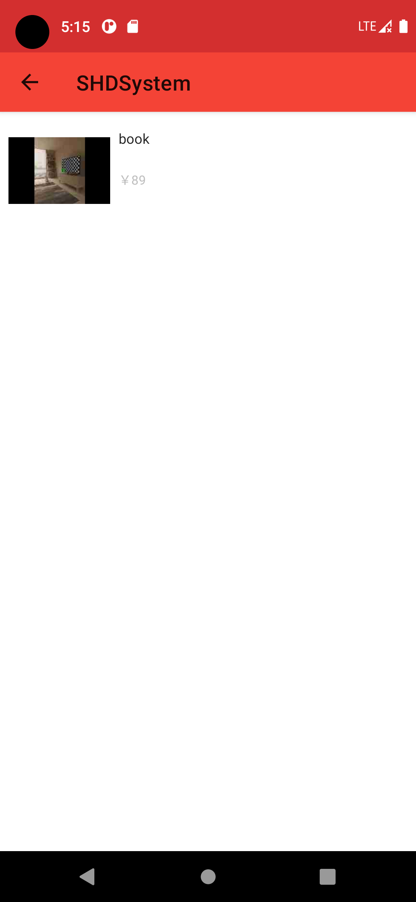

# SHDSystem Demo
Second-Hand Goods Dealing System Based on Android and Spring Boot. 基于 Android 和 Spring Boot 的二手商品交易系统。

### 一、说明/介绍

> 本项目为安卓课程开发任务作品，为 Android Dev 接近零基础的小白在短时间内通过 Google 和 [Material Design](https://material.io) 紧急开发的结课作品，很垃但基本功能相对完善的 App。代码中有丰富的注释，后续不再继续优化升级和维护。

### 二、基本功能
- 用户注册、登录；
- 商品的卡片列表展示、商品详情和购买；
- 用户商品的发布、列表展示和修改；
- 用户购买记录。

### 三、基本环境 or 工具
- Android Studio
- JDK 11
- IDEA
- okhttp
- glide
- gson
- MySQL
- IDEA中 EasyCode 插件

### 四、当前还存在问题
- App 的 UI 未优化；
- 后台中多余的未使用到的接口、服务未去除（因为后台大部分使用 EasyCode 快速生成）；
- Java 和 MySQL 的日期类型未做好映射，但Android中未使用到日期。

### 五、Show

